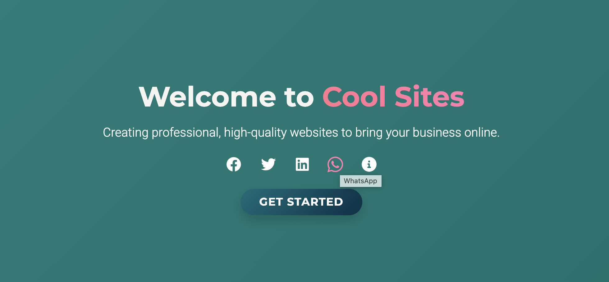
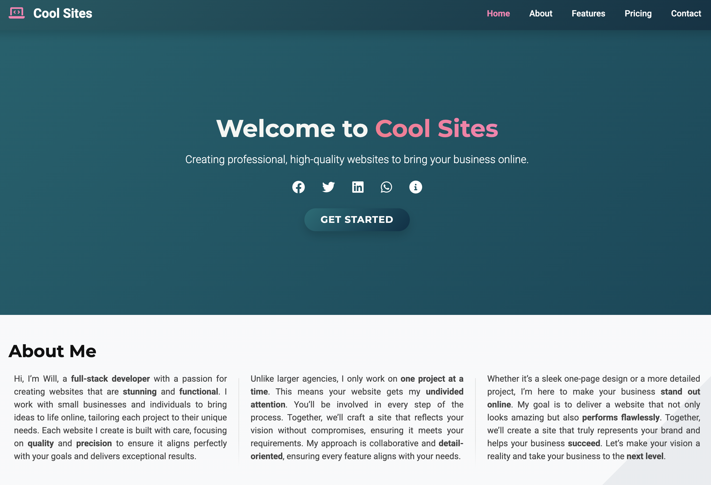
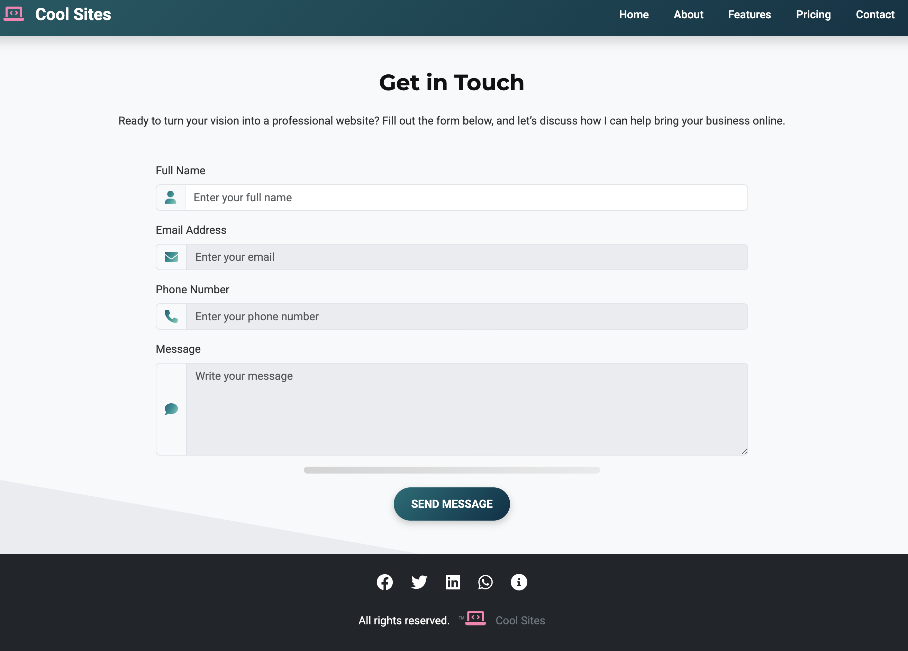
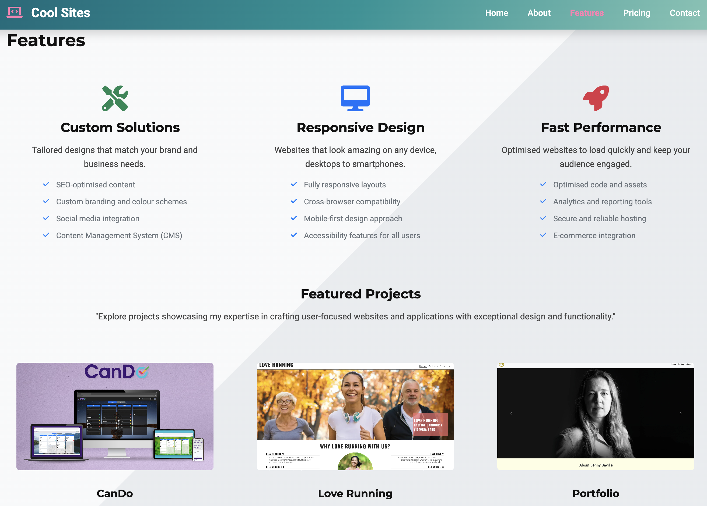
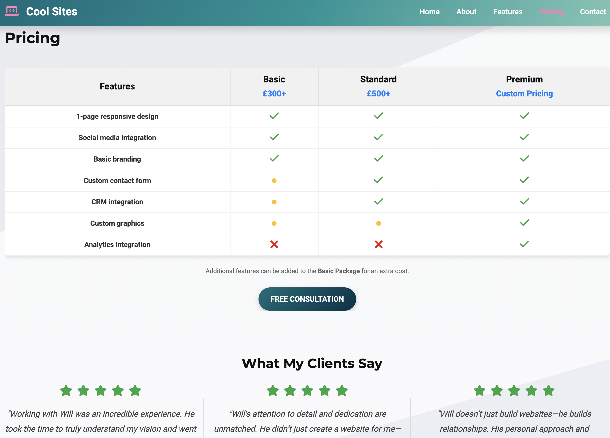

# CoolSites 🌟



**CoolSites** is a fully responsive website designed to showcase my web development services and provide a live demo for potential clients. Whether you're a small business owner or an individual looking to create an online presence, this project serves as both a portfolio of my work and a tool to help clients visualise the possibilities for their own websites.

---

## 🌍 **Live Demo**

Experience the live demo: [CoolSites](https://wgwhitecoding.github.io/CoolSites/)  

This site demonstrates professional design, user-friendly features, and responsive layouts, helping clients decide what they want for their own websites.

---

## ✨ **About This Project**

CoolSites is built to:

- **Sell Services**:  
  Showcase my skills and highlight the types of websites I can build for clients.
  
- **Demo Features**:  
  Help clients explore various website elements like responsive design, contact forms, feature sections, and pricing pages, so they can pick and choose the features they want.

- **Client-Centric Customisation**:  
  The website is designed to reflect different possibilities, from simple one-page designs to fully-featured, multi-page business websites.

---

## 📱 **Fully Responsive Design**

CoolSites is fully responsive, offering an exceptional experience on any device:

- **Desktop**: Full-sized layout with attention to detail.
- **Tablet**: Compact and easy-to-navigate design.
- **Mobile**: Optimised layouts for seamless interaction on smaller screens.

---

## 📸 **Screenshots**

### Homepage  


### Contact Page  


### Features Section  


### Pricing Section  


---

## ✨ **Key Features**

### 🌟 For Clients:

- **Modern Design Demo**:  
  A sleek, professional layout showcasing clean typography, smooth navigation, and eye-catching visuals.

- **Interactive Contact Form**:  
  Powered by [Email.js](https://www.emailjs.com/) to demonstrate how inquiries can be handled directly from the site.

- **Customisable Sections**:  
  Includes a homepage, features section, pricing table, and contact page—everything a business might need.

- **SEO and Branding Options**:  
  Displays possibilities for SEO-optimised content, custom branding, and social media integration.

---

## 🚀 **Technologies Used**

This website is built using modern web development tools:

- **HTML5**: For semantic structure and accessibility.
- **CSS3**: For responsive design, animations, and styling.
- **JavaScript**: For interactive features like form submissions.
- **Email.js**: To handle contact form submissions.
- **Netlify**: For hosting and deployment.

---

## 🛠 **How to Use This Demo**

### For Clients:

1. Explore the live site: [CoolSites](https://wgwhitecoding.github.io/CoolSites/).
2. Browse the features and pages to see what's possible.
3. Use the contact form to reach out and discuss your website needs.

### For Developers:

1. **Clone the Repository**:
   ```bash
   git clone https://github.com/wgwhitecoding/CoolSites.git


2. **Open the Project**
   ```bash
   cd CoolSites

3. **Open in Browser:**
   Open index.html in your preferred browser.

### 🔮 Future Plans

#### CMS Integration:  
Allow clients to update their content dynamically without needing technical skills.

#### Analytics:  
Implement tracking tools to monitor user activity and engagement for clients' sites.

#### Additional Demos:  
Include more variations, such as e-commerce layouts, blogs, and portfolio sites.

#### Pricing Calculator:  
Let clients calculate estimated costs for their website needs directly on the site.

---

### 🤝 Work With Me

If you're looking for a custom website tailored to your business or personal needs, I can help! Here’s what I offer:

#### One-on-One Collaboration:  
I work closely with you to understand your vision and deliver a website that exceeds expectations.

#### Tailored Solutions:  
From single-page websites to multi-functional platforms, everything is built with your goals in mind.

#### Reliable Support:  
After the website is delivered, I provide ongoing support to ensure everything runs smoothly.

---

### 📄 License

This project is licensed under the MIT License. See the [LICENSE](LICENSE) file for details.

---

### ✨ Let’s Build Something Amazing! ✨

Explore the demo, reach out via the contact form, or email me directly. I look forward to helping you bring your ideas to life!


   


